# Adobe Building Practicum 
## Pecos National Park - David Kennedy

---
### The Park: Background  
Pecos National Historical Park is located 30 miles east of Santa Fe NM, at the confluence of Glorieta Creek and Pecos River, and on the edge of the Rocky Mountains and the Great Plains.Near by Glorieta Pass connects the Plains with the Rio Grand Valley. This prize location has made this an area for human settlement for over twelve thousand years.

<figure>
    
    <figcaption style="text-transform: uppercase;">Pecos Location Map</figcaption>
</figure>

### The Park: History

<figure>
    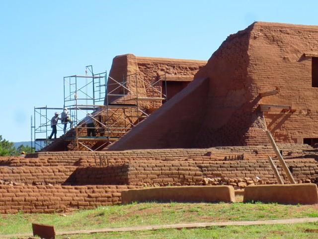
    <figcaption style="text-transform: uppercase;">Preservation Work at Pecos</figcaption>
</figure>

Pecos became a State Monument in 1935, and National Park in 1965 and 1990s became a National Historic Park. The Pueblos, Church, and Convento at Pecos National Historical Park are listed on the [National Register of Historic Places]
 

<figure>
    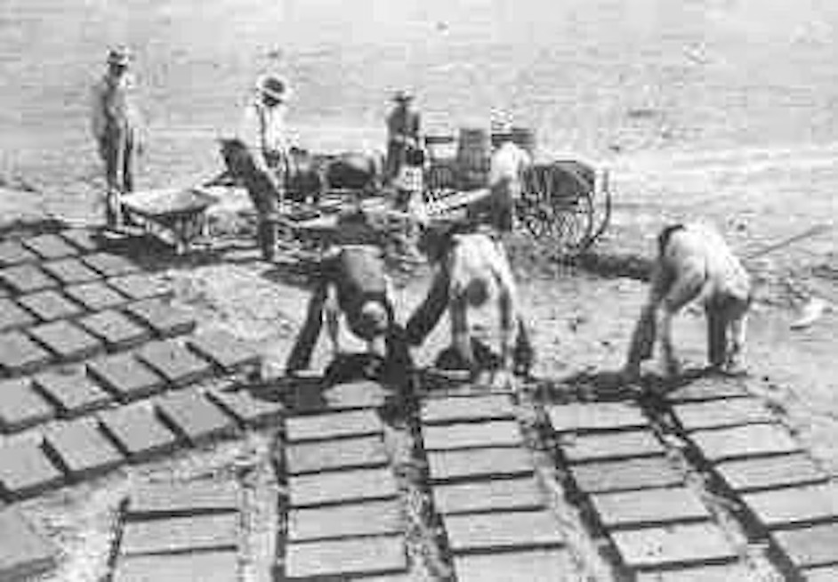
    <figcaption style="text-transform: uppercase;">Preservation at Pecos has been on going since the early twientieth century.</figcaption>
</figure>

>Starting in 1915, archeologists Alfred Kidder and Jesse Nusbaum removed accumulated debris from the church interior. Over the next several years, Nusbaum and a team of workmen rebuilt portions of the church based on locations of architectural features they identified, such as doors and windows.

>The philosophy of historic preservation has since changed. Rather than reconstruct fallen parts of the building, recent preservationists have been faced with the challenge of how best to shelter what remains of the original church and convento walls. In addition, any work more than 50 years old, including that of Nusbaum, is now considered historic in its own right and must be taken into account when planning preservation treatments.

>[@cite: National Park Service Website](https://www.nps.gov/peco/learn/historyculture/preservation.htm#:~:text=At%20Pecos%2C%20treatment%20efforts%20have,debris%20from%20the%20church%20interior.)

## Introduction: My Practicum
I was interested in doing field work at multiple locations but in the end I spent the entire practicum working at the [Pecos National Historical Park](https://www.nps.gov/peco/index.htm) and specifically working with the Preservation team in and around the Convento of the Spanish Mission Church and Pueblo. Over the course of five weeks I worked with a team of Interns and Park Rangers under direction from Park Archaeologists **Jeremy Moss** and **Kate Scot**.  

## Timesheet for David Kennedy @ Pecos

|Week| Dates | Daily Hours |Total|
|:--:| :---: | :---: | :---:     |
| 1  |6/30/22|  6.25 |  6:25     |
| 2  |7/07/22|  6.25 | 12:30     |
| 3  |7/13/22|  6.25 | 18:45     |
| 3  |7/14/22|  6.25 | 25:00     | 
| 4  |7/20/22|  6.25 | 31:15     |
| 4  |7/21/22|  5    | 37:30     |
| 5  |7/25/22|  6.25 | **43:45** |

## Log Entries 01 - Day 1

**Week 1**

06/30/2022

8am-3pm

15 minute break at 10am and 30 minute break for lunch at 12pm

**Hours:** 6 hr 15 mins

**Hours to date:** 6:15

---

On arriving I went to the office and filled out HR paperwork so I would be allowed on site. I then reported to **Kate** and was introduced to the crew, I was introduced to **Bree** and **Christopher** and began to help them. They were working in the Convento, replastering the walls using a cherry picker. The floor of the Convent is flagstone so plywood had to be laid and moved for the cherry picker so it didn’t crack the stone.

<figure>
    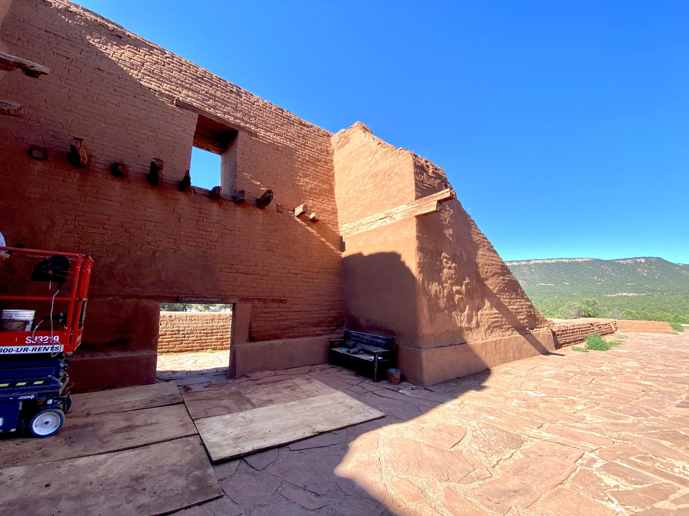
    <figcaption style="text-transform: uppercase;">First day helped replaster cracked walls in the Convento.</figcaption>
</figure>

**Kate** assigned me to shadow **Christoper** (an Intern) he showed me how to make mud. The mix was 4 parts Clay Soil to 5 parts Sand and Diluted [Rhoplex](https://www.dow.com/en-us/pdp.rhoplex-2510-acrylic-emulsion.482730z.html#overview) to consistency _(approx  1.5 liters)_
**Christopher** showed me where the tools are stored and I got familiar with how the day goes. We enjoyed a break in the shade at 10am, and lunch at  noon.  By 2:20pm we started to clean up, all tools buckets and Wheelbarrows needed to be cleaned and returned to a locked tool box and tool area. 
By the end of the day I had a good idea of who does what, where things are located, and what they consider the correct consistency for Plaster Mix. 
<figure>
    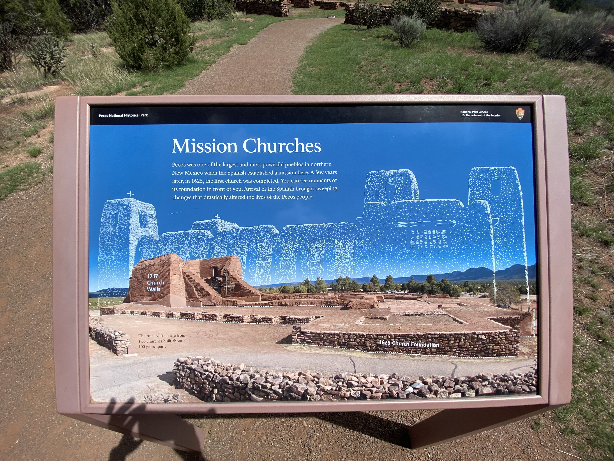
    <figcaption style="text-transform: uppercase;">At the end of the day I walked around and read up on the history of the site.</figcaption>
</figure>

___

## Log Entries 02 - Day 2

**Week 2**

07/07/2022 

8am-3pm

15 minute break at 10am and 30 minute break for lunch at 12pm

**Hours:** 6 hr 15 mins

**Hours to date:** 12:30

___

Reported to **Kate**, she asked me to work with **Jeremy**. He showed myself and **Mark** how to clean and prepare a _Wall Cap_ for replastering. We brushed the wall top with small seagrass broom, then primed the cleaned cap with water and filled the biggest cracks with mud. We repeated this over several walls. After break the mud in the craks were dry enough to be worked over with a second coat this time over the entire _Cap_ of the wall.
Dampened burlap was placed on the freshly capped walls to slow the drying process and reduce cracking. 
In the afternoon I asissed in cleaning and pointing joints in the walls. The same process of brushing and removing any loose mortar / plaster, then priming with water and repointing the joints.  
When the mortar is leather hard the joints are brushed to remove any tool marks. Today the Mud mix was a little different (We had to adjust to a 1:1 Clay Soil: Sand Mix) as the sand and clay soil has been getting wet from the afternoon rains.

---

<figure>
    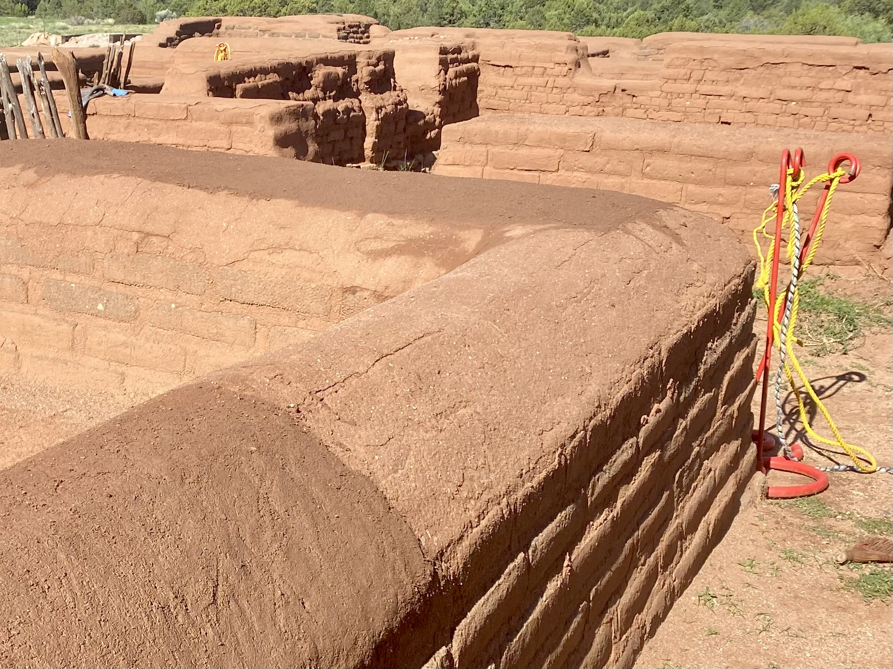
    <figcaption style="text-transform: uppercase;">After break the filling in the cracks was dry enough to apply a plaster coat to the full cap.</figcaption>
</figure>

<figure>
    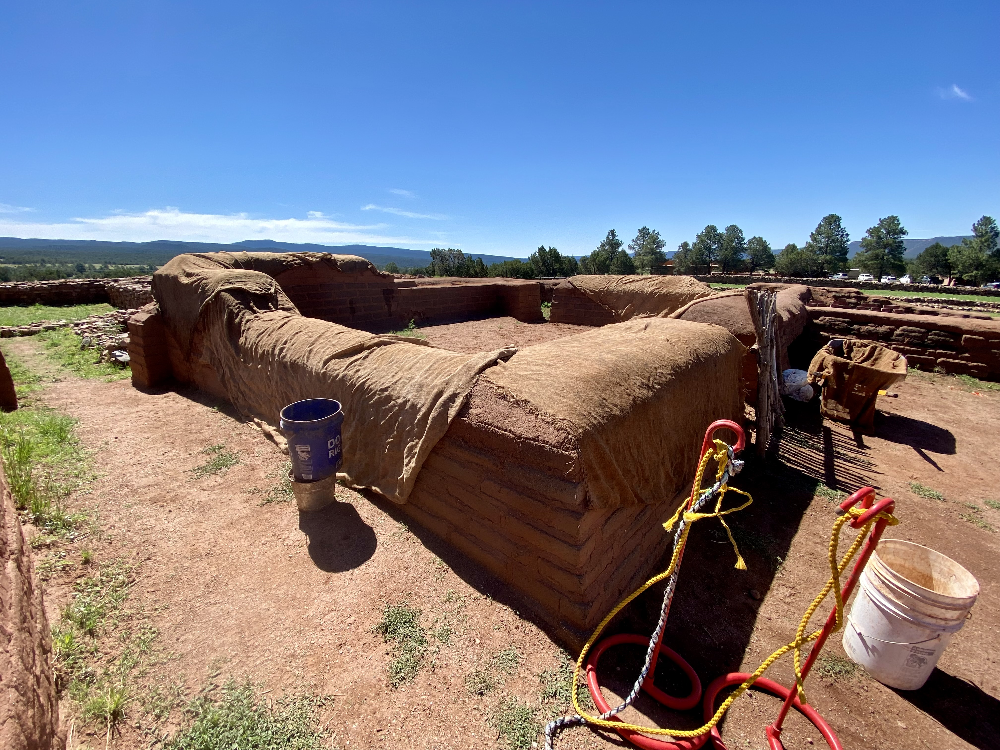
    <figcaption style="text-transform: uppercase;">Dampened burlap slows the drying process and reduce cracking. </figcaption>
</figure>

<figure>
    
    <figcaption style="text-transform: uppercase;">Wet Clay is impossible to screen when its damp</figcaption>
</figure>

---

## Log Entries 03 - Day 3 

**Week 3**

07/13/2022

8am-3pm

15 minute break at 10am and 30 minute break for lunch at 12pm

**Hours:** 6 hr 15 mins

**Hours to date:** 18:45

___

<figure>
    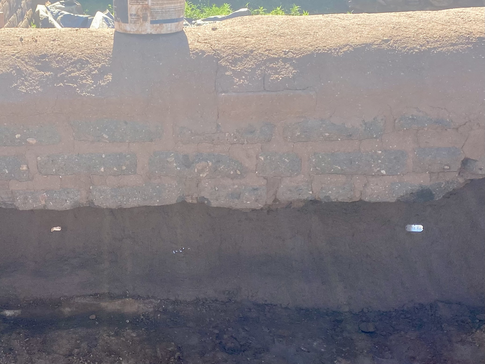
    <figcaption style="text-transform: uppercase;">Metal Tags mark a new intervention in the old walls</figcaption>
</figure>

 

At Pecos, the goal of preservation activities is to stabilize and repair the existing buildings to reflect the history of the site appropriately. The intention is not to reconstruct, or build anew what once existed, but rather to preserve what is already there.
 

The highlight of today was watching the beginnings of a supporting wall replacement. A porting of a wall was removed as it was bulging and the protective veneer was pulling away from the main structure. The team had cleaned out all the brick and plaster and were applying a coat of mortar to the wall. They marked this intervention with dated metal tags for future excavators.

The rest of the day was spent Pointing and Plastering Walls.

<figure>
    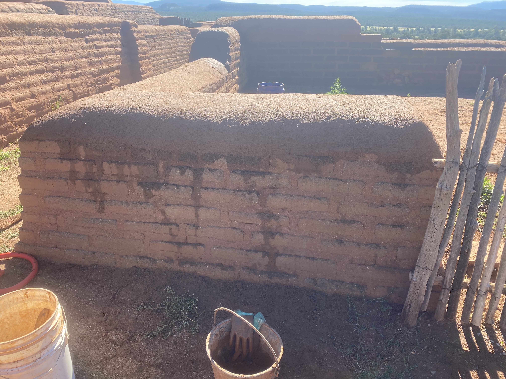
    <figcaption style="text-transform: uppercase;">Freshly Plastered Wall Caps</figcaption>
</figure>
<figure>
    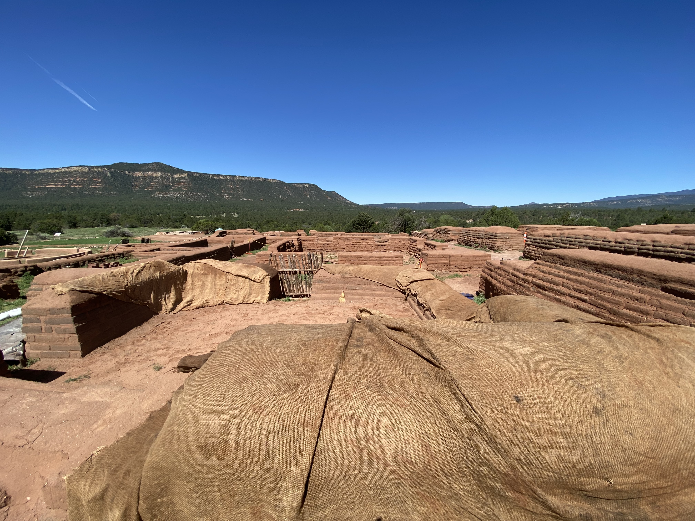
    <figcaption style="text-transform: uppercase;">Damp Burlap on freshly plastered caps</figcaption>
</figure>

---
## Log Entries 04 - Day 4

**Week 4**

07/14/2022

8am-3pm

15 minute break at 10am and 30 minute break for lunch at 12pm

**Hours:** 6 hr 15 mins

**Hours to date:** 25:00

---

<figure>
    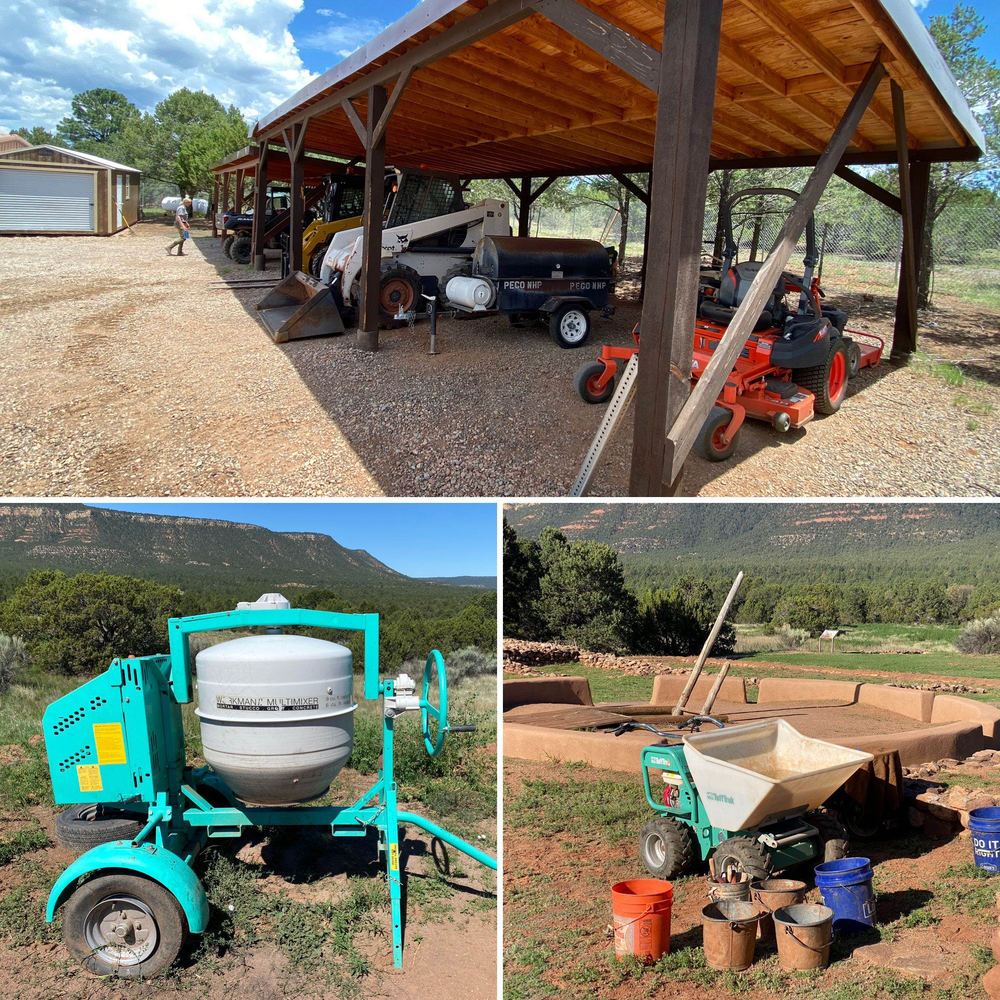
    <figcaption style="text-transform: uppercase;">The Park has amazing Equipment resources</figcaption>
</figure>

The day was spent _Pointing and Plastering Wall Caps_. I was struck by how much I have improved over the last few working day, I am getting faster and more confident in applying mud and the finish I am getting is more consistent. Large sections of wall like this can take a long time to do, and it takes a lot of mud to do it. Gas powered Barrows and Mixers really help out when you have a task that’s already taxing physically.

 

While this building material is durable in New Mexico's climate, the adobes last longer when protected from the elements with a coat of mud plaster. Made from the same mud mix as adobe bricks, the plaster will take the brunt of the weather, much like the siding on your house. Historically this is how the building walls were treated at Pecos.
 

<figure>
    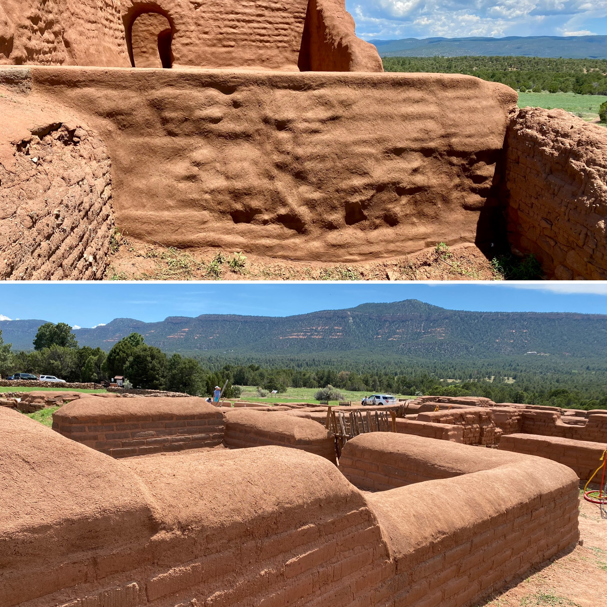
    <figcaption style="text-transform: uppercase;">Large areas require a lot of Mud</figcaption>
</figure>

---
<figure>
    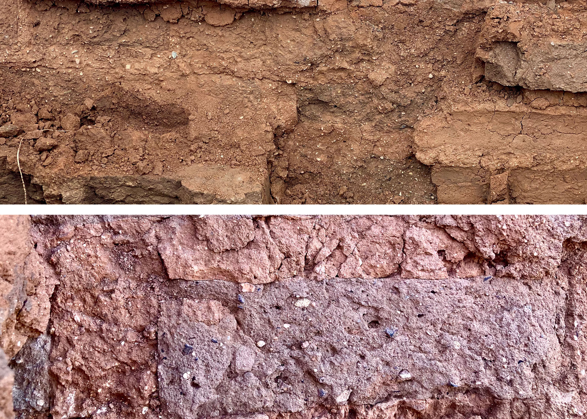
    <figcaption style="text-transform: uppercase;">STAGES: Outer veneer removed, and Original wall exposed
</figcaption>
</figure>

The treatment you see on the walls of the Pecos church is called encapsulation. The fragile original adobe bricks have been encased with new adobes made here at Pecos. This encapsulation method protects the historic adobes (now inside the wall) that would otherwise weather away.

---

Today I also got to observe and help with the removal of a portion of failing wall. We slowly removed the plaster mortar and brick to reveal the historic brick beneath

<figure>
    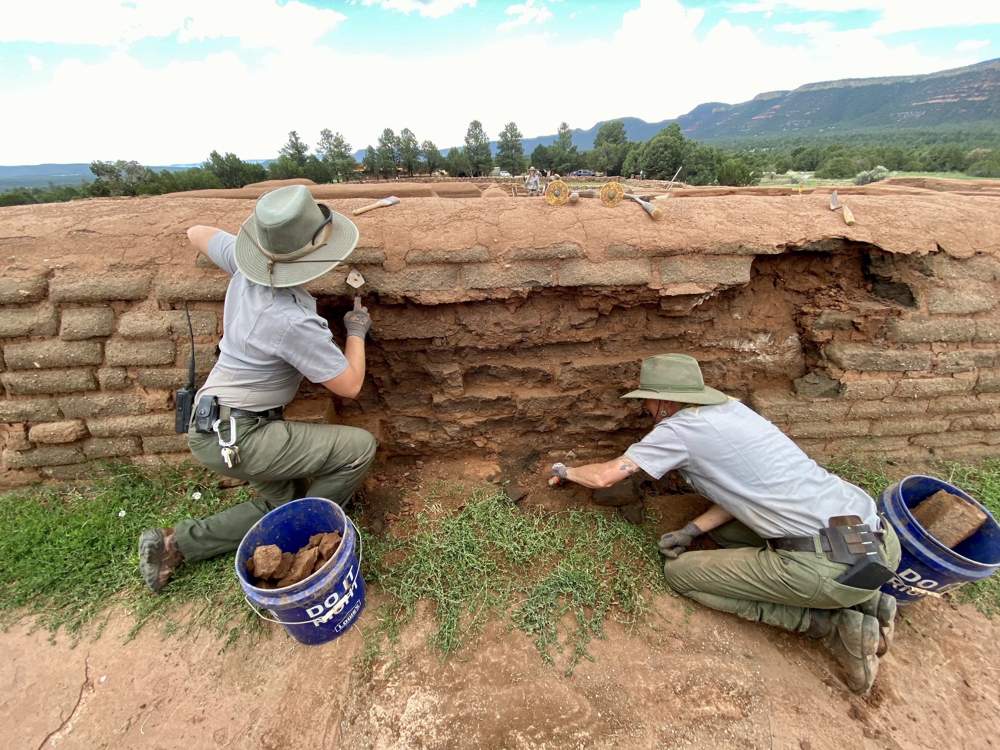
    <figcaption style="text-transform: uppercase;">Removing the worst portion of a damaged wall
</figcaption>
</figure>

---

## Log Entries 05 - Day 5

**Week 4**

07/20/2022

8am-3pm

15 minute break at 10am and 30 minute break for lunch at 12pm

**Hours:** 6 hr 15 mins

**Hours to date:** 31:15

___

Today I did a lot of observing and assisting on a large wall that needed courses replaced after the veneer front had started to pull away from the wall. Metal Tags date and mark the point of intervention for future preservationists.

<figure>
    
    <figcaption style="text-transform: uppercase;">Creating large wet joints with finger pockets to help the mortar bond to the bricks.
</figcaption>
</figure>
<figure>
    
    <figcaption style="text-transform: uppercase;">The adobe block is *Keyed* into the existing wall.
</figcaption>
</figure>
The adobe blocks are set on a thick layer of mortar, *Keying* should happen at least every third course.
<figure>
    
    <figcaption style="text-transform: uppercase;">Loose blocks are staged for fit and placement
</figcaption>
</figure>

The above image shows the sequence of fitting and placing blocks. This technique called *Staging* helps determine placement and fit. 
After **Brie** placed the course I got to point around them with mud.

---

## Log Entries 06 - Day 6

**Week 4**

07/21/2022

8am-1:30pm

15 minute break at 10am and 30 minute break for lunch at 12pm

**Hours:** 4hr 45mins

**Hours to date:** 37:30

---

We made several large batches of Mud with help from the [Imer Multi Mixer](https://imerusadirect.com/products/workman-250-electric)
and the [Whitman WBH-16 ](WBH-16Fhttps://www.multiquip.com/multiquip/WBH16F.htm) Gas powered Wheelbarrow.

<figure>
    
    <figcaption style="text-transform: uppercase;">power tools for major mud mixing
</figcaption>
</figure>

<figure>
    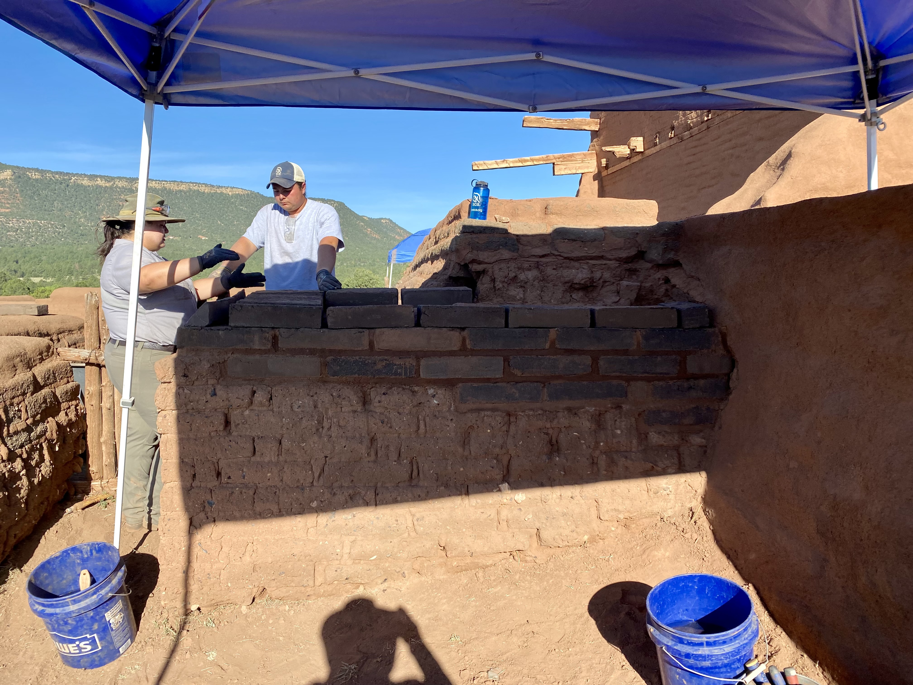
    <figcaption style="text-transform: uppercase;">Shade help slow the drying process and prevents burnout
</figcaption>
</figure>

After **Brie** and **Mason** cut and layed blocks I was able to mortar and point around them.

<figure>
    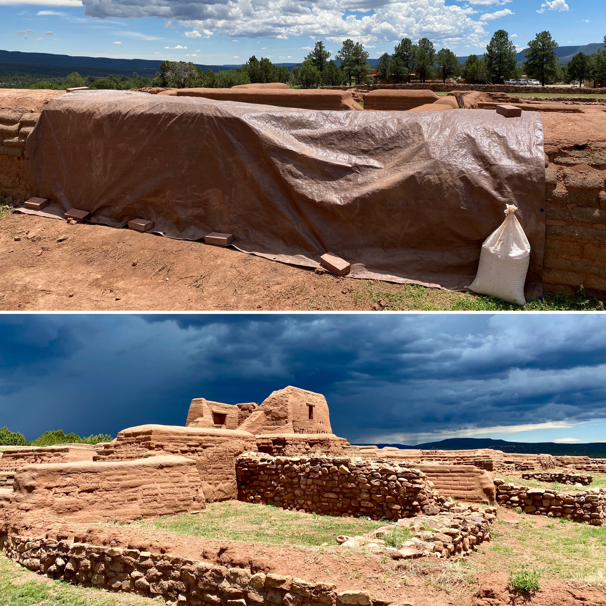
    <figcaption style="text-transform: uppercase;">Tarps protect work from the damage of the rain
</figcaption>
</figure>

We had to break for the day a few hours early as an unexpected storm quickly developed.

---

## Log Entries 07 - Day 7

**Week 5**

07/25/2022

8am-3pm

15 minute break at 10am and 30 minute break for lunch at 12pm

**Hours:** 6hr 15mins

**Hours to date:** 43:45

---

The team had made a lot of progress on Friday so by Monday we were placing the cut capping bricks. I did a lot of observing, mixing mud, and pointing, once the brick were layed and got approval from **Kate** and Jeremy I was able to point around them. I also got to lay a few brick. I have really enjoyed my time working with this team, they made me feel useful, and I felt they appreciated the help. 

<figure>
    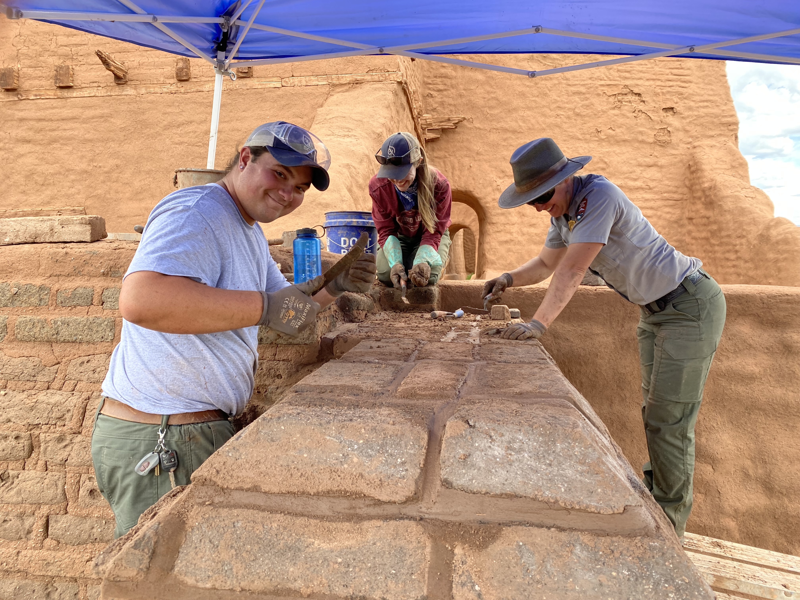
    <figcaption style="text-transform: uppercase;">Finishing the Wall Cap
</figcaption>
</figure>

---

## Learning Outcome

* Clay is impossible to screen when its damp, it has been super annoying to find organic matter and aggregate in the plaster as it scrapes the surface of the caps and joints when you apply , so it slows down the process as you have to rework the finish and remove the object and refinish. 
    
  
- The right equipment is very important things like adequate shade to power tools like the [arborteh brick and mortar saw](https://www.amazon.com/ARBORTECH-ALLSAW-Masonry-Restoration-ALL-FG-175110-20/dp/B07T2MV982) make a huge difference to productivity.  
    
  
- Other power tools like a Multimixer for Plaster / Mortar / Adobe and Power Wheel Barrows really help with burnout and keeping energy level high.  
    
 
- I feel like the time i spent mixing Mud was time well spent. I got a real feel for it, and found that I have improved enormously.  
    
 
- As much as I liked working on preserving, it was quite frustrating at time to see the process of only removing the damaged areas of walls, I feel like it took so much extra time to match in little portions when removing a larger area top to bottom would have been faster and made for a stronger wall in the end.  
    
 
- Measurement and Leveling was not great, No speed leads were used but we were trying to match to old irregular walls, so it was not a matter of being able to learn skills that were best Practices.  
    
 
- I also felt at time that communication was poor, when it came to a plan for rebuilding walls. I think that making a small sketch would have been helpful so everyone could see what the objective was and what the result should look like.  
    
 
- I think that one of the most important insights I had was talking and interacting with the crew that were seasonal and hearing about how difficult it is to find accomadation in the Pecos and Santa Fe area. I really feel that I want to work towards increasing the supply of well build natural dwellings that are well built , affordable, and I wonder if being a builder is the best way to have the greatest impact. I wonder if working in community planning and advocacy would be a better path or at least something to explore, as it has made me question how I can have the greatest impact. Definitely Volunteering will be something I want to continue to do and I am disappointerrd that cornerstone did not have any project for me to contriubute to over the summer.  
   
  

